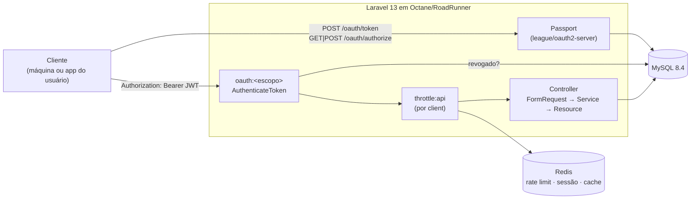

# laravel-oauth2-api

[](https://github.com/andreccls/laravel-oauth2-api/actions/workflows/ci.yml)
[](https://www.php.net/)
[](https://laravel.com/)
[](LICENSE)
[](#cobertura)

> ⚠️ **PROJETO DE EXEMPLO DE CÓDIGO (reference / sample) — NÃO É UM PRODUTO PRONTO PARA PRODUÇÃO.**
> Existe para demonstrar **OAuth2 com Laravel Passport + Octane**, testes e documentação. As senhas, a `APP_KEY` e os
> segredos do `docker-compose.yml`/`.env.example` são **apenas de desenvolvimento**. Não o publique na internet como
> está. A lista honesta do que falta está em [Limitações conhecidas](#limitações-conhecidas-e-próximos-passos).

> 🇬🇧 Short English summary at the [end of this file](#english-summary) (and in [README.en.md](README.en.md)).

API **somente backend** (nada de Blade/front) em **PHP 8.4 + Laravel 13** que implementa um **servidor OAuth2 real**
com **Laravel Passport** — *authorization code + PKCE*, *client credentials* e *refresh token* (o *password grant*
**não** é oferecido: foi removido do OAuth 2.1) — protegendo um recurso de negócio (`tasks`) por **escopos**.
Roda em **Laravel Octane (RoadRunner)** com **MySQL 8.4** e **Redis**; há um benchmark real contra php-fpm abaixo.

Serve de **template**: o passo a passo para proteger um novo recurso por escopo está em
[docs/ARCHITECTURE.md](docs/ARCHITECTURE.md#5-como-adicionar-um-recurso-protegido-por-escopo-passo-a-passo).
Desenhado seguindo **SOLID, KISS e YAGNI** — por isso **não** tem repositórios genéricos, camada de DTO, password
grant nem device flow; cada escolha relevante está num [ADR](docs/adr).

## Arquitetura



Diagramas de sequência de cada fluxo (client credentials, authorization code + PKCE, refresh/revogação) e a tabela de
respostas 401/403/404/422/429 estão em [docs/ARCHITECTURE.md](docs/ARCHITECTURE.md#2-fluxos-oauth2).

## Estrutura de pastas

```
.
├── app/
│   ├── Http/{Controllers,Middleware,Requests,Resources}/   # AuthenticateToken (oauth:<escopo>), TaskController, Form Requests, API Resources
│   ├── Models/ Enums/ Services/                           # Task, TaskItem, User · TaskService (transação)
│   ├── Support/{Scopes,Principal,ProblemDetails}.php       # escopos (fonte única) · quem chama · erros RFC 9457
│   └── Providers/AppServiceProvider.php                    # Passport (TTL, consent JSON), rate limiters, OpenAPI
├── routes/{api,web,console}.php                           # api: escopos nas rotas · web: só /login · console: passport:purge agendado
├── database/{migrations,factories,seeders}/                # migrations do Passport publicadas + tasks + índices de purge
├── tests/{Unit,Feature,Support}/                          # 59 testes
├── docs/ (ARCHITECTURE.md, adr/, openapi.json, benchmark-raw.txt)
├── scripts/ (demo.sh, bench.sh, coverage-gate.php)
└── Dockerfile  docker-compose.yml  Makefile  .github/workflows/ci.yml
```

## Como rodar

Pré-requisito: **Docker** + `make` (e `curl`/`jq` para o demo). **Não precisa de PHP nem Composer no host.**

```bash
make up      # Octane + MySQL 8.4 + Redis + scheduler  ->  http://localhost:8088
make demo    # semeia o usuário de demo e roda o passeio completo de OAuth2 com curl (scripts/demo.sh)
make down    # para tudo (mantém os volumes)
```

Portas de host (todas em `127.0.0.1`, configuráveis via `.env`/ambiente): API **8088**, php-fpm do benchmark **8089**,
MySQL **3318**, Redis **6389**. As chaves do Passport (`storage/oauth-*.key`) são geradas no 1º start do container
(`passport:keys`) e **nunca** vão para o git.

Criar clientes (não há endpoint HTTP para isso — é decisão de operador):

```bash
docker compose exec api php artisan passport:client --client --name="meu-servico"                       # client credentials
docker compose exec api php artisan passport:client --public --name="meu-app" --redirect_uri=https://app.example/cb   # authorization code + PKCE
```

### Evidência: o fluxo real por curl (saída do `make demo`, resumida)

Executado em 2026-10-06 contra a stack real (Octane + MySQL + Redis):

```text
== 2. Get a token (client credentials, scopes tasks:read tasks:write)
{"active":true,"subject_type":"client","scopes":["tasks:read","tasks:write"],"expires_at":"2026-10-06T14:54:47+00:00",...}
== 3. Protected resource: create + list
POST /api/tasks -> 201          GET /api/tasks -> 200
GET /api/tasks with If-None-Match "1b189f4c…" -> 304 (revalidated)
== 4. Insufficient scope: token with tasks:read only tries to write
{"type":"about:blank","title":"Forbidden","status":403,"detail":"The access token lacks a required scope.","required_scopes":["tasks:write"]}
== 5. No token
HTTP/1.1 401 Unauthorized   Content-Type: application/problem+json   Www-Authenticate: Bearer
== 6. Revoke the token, then reuse it
POST /api/oauth/revoke -> 204        GET /api/me -> 401
== 7. Authorization code + PKCE (public client)
POST /login -> 204
consent screen: {"client":{...},"scopes":[{"id":"tasks:read","description":"Read your tasks"}]}
redirected to: https://app.example.test/callback?code=def502…&state=xyz
token response: {"token_type":"Bearer","expires_in":3600,"has_refresh":true}
{"active":true,"subject_type":"user","subject_id":"1","scopes":["tasks:read"],...}
== 8. Refresh token (rotation)
refreshed: {"token_type":"Bearer","expires_in":3600}      reusing the old refresh token -> "invalid_grant"
== 9. Password grant is not offered
"unsupported_grant_type"
```

## Endpoints

| Rota | Escopo | Descrição | Respostas |
|---|---|---|---|
| `POST /oauth/token` | — | Passport: `client_credentials`, `authorization_code` (+ `code_verifier`), `refresh_token` | 200 · 400 · 401 (RFC 6749) |
| `GET /oauth/authorize` · `POST /oauth/authorize` · `DELETE /oauth/authorize` | sessão do usuário | Consentimento (JSON), aprovação, negação | 200 · 302 · 400 · 401 |
| `POST /login` | — | Sessão do dono do recurso (só para o authorization code); 5/min por e-mail+IP | 204 · 422 · 429 |
| `GET /api/me` | qualquer token | Introspecção do **próprio** token: sujeito, client, escopos, expiração | 200 · 401 |
| `POST /api/oauth/revoke` | qualquer token | Revoga o access token e o refresh token dele | 204 · 401 |
| `GET /api/tasks?status=&per_page=&page=` | `tasks:read` | Lista paginada (máx. 50), `ETag`/304 | 200 · 304 · 401 · 403 · 422 |
| `GET /api/tasks/{id}` | `tasks:read` | Consulta (`ETag`/304) | 200 · 304 · 404 |
| `POST /api/tasks` | `tasks:write` | Cria (com `items` opcionais) | 201 (+`Location`) · 422 |
| `PUT\|PATCH /api/tasks/{id}` | `tasks:write` | Atualiza; `items` enviado **substitui** os itens | 200 · 404 · 422 |
| `DELETE /api/tasks/{id}` | `tasks:write` | Remove (cascata nos itens) | 204 · 404 |
| `GET /up` | — | Health do Laravel | 200 |

Todas as rotas `/api/*` aceitam token de usuário **e** de cliente-máquina; cada dono só enxerga as próprias tarefas.
`tasks:write` **não** implica `tasks:read`. Rate limit: 120 req/min **por client OAuth** (429 + `Retry-After`).
Documento **OpenAPI 3.1**: [docs/openapi.json](docs/openapi.json) (gerado pelo [Scramble](https://scramble.dedoc.co) a
partir de Form Requests/Resources — sem anotações escritas à mão; um teste falha se ficar desatualizado; `make openapi`
regenera). Limites do documento: não descreve `/oauth/*` (são do Passport; só o esquema OAuth2 e os escopos aparecem) e
o requisito de escopo por rota não é expresso (a descrição da API o explica).

## Performance

| Medida | Onde |
|---|---|
| Octane + RoadRunner, 4 workers, reciclagem a cada 1000 req | [ADR 0002](docs/adr/0002-octane-roadrunner.md) |
| `config:cache`, `route:cache`, `event:cache`, autoloader *classmap-authoritative*, opcache sem revalidar timestamps | `docker/entrypoint.sh`, `Dockerfile`, `docker/php.ini` |
| Redis para cache, sessão e rate limit (script Lua) | [ADR 0004](docs/adr/0004-redis.md) |
| Índices `tasks (owner,id)` e `(owner,status,id)` (conferidos com `EXPLAIN`, 20 mil linhas); `expires_at`/`revoked` p/ purge | migrations |
| Sem N+1: `with('items')` + lazy loading proibido fora de produção + teste de contagem de queries | `TaskController`, `AppServiceProvider`, `TaskPerformanceTest` |
| `ETag` + `Cache-Control: private, max-age=0, must-revalidate` → 304 sem reserializar para o cliente | `routes/api.php`, `HttpCachingTest` |
| Tokens com expiração (60 min / 14 dias) e `passport:purge` diário (serviço `scheduler`) | `config/api.php`, `routes/console.php` |

### Benchmark: php-fpm vs Octane (medido, não estimado)

**O que foi medido:** `GET /api/tasks?per_page=20` com Bearer JWT (valida assinatura RS256 + consulta de revogação no MySQL +
rate limit no Redis + `COUNT` + listagem + eager loading de itens; 30 tarefas × 2 itens, 20 retornadas).

**Metodologia** (`make bench`, `scripts/bench.sh`): mesma imagem/código/PHP 8.4/opcache nas duas pontas; **php-fpm**
(`pm=static`, 4 filhos) atrás de nginx 1.27 **vs** **Octane/RoadRunner** (4 workers); mesmo MySQL e Redis; gerador de
carga **ApacheBench** (`httpd:2.4-alpine`) dentro da rede do compose, `-k` (keep-alive), **c=16**, **n=10 000** por rodada,
**5 rodadas intercaladas** por alvo depois de 2 000 requisições de aquecimento; rate limit elevado só durante o teste.
Apple M3 (8 CPUs), Docker Desktop com 8 CPUs / ~8 GB — **a máquina inteira é compartilhada** entre carga, API, MySQL e Redis.

| (mediana de 5 rodadas) | Requisições/s | p50 | p95 | p99 | Falhas |
|---|---|---|---|---|---|
| **Octane (RoadRunner)** | **505,5** | 26 ms | 61 ms | 96 ms | 0 |
| php-fpm + nginx | 361,1 | 35 ms | 88 ms | 160 ms | 0 |

Rodadas individuais (req/s): Octane 586,8 · 447,5 · 534,6 · 505,5 · 390,3 — php-fpm 368,1 · 365,1 · 361,1 · 338,5 · 302,1.
Dados brutos: [docs/benchmark-raw.txt](docs/benchmark-raw.txt).

**Leitura honesta:** Octane ficou ≈ **1,4×** mais rápido em vazão (mediana) e com latência menor, mas **há variação grande
entre rodadas** (a pior rodada do Octane, 390 req/s, ainda superou a melhor do php-fpm, 368; os intervalos quase se tocam).
É **máquina local**, ApacheBench, uma única configuração (c=16, 4 workers) e um único endpoint — serve de indicativo, não
de promessa de produção. O ganho é moderado porque o tempo desse endpoint é dominado por criptografia + 4 queries + Redis,
e não pelo *boot* do framework (que é o que o Octane elimina).

## Testes

```bash
make test         # TODOS os testes, SQLite em memória (≈5 s, sem serviços)
make test-mysql   # a MESMA suíte contra MySQL 8.4 real (banco oauth2_test)
make lint         # Laravel Pint + Larastan/PHPStan nível 8 (inclui tests/)
make coverage     # PCOV; FALHA se linhas < COVERAGE_MIN (padrão 100). HTML em coverage/html
```

Tudo roda em containers (`docker compose --profile tools run tools ...`); o `vendor/` fica num volume nomeado.

**Cobertura** — PHPUnit 12, **59 testes / 286 asserções, todos verdes** (rodado em 2026-10-06; também verdes no MySQL 8.4):

<a id="cobertura"></a>

| Métrica | Resultado | Política |
|---|---|---|
| Linhas | 186/186 = **100 %** | **gate** (`make coverage`, CI) |
| Métodos | 100 % | só relatório |
| Branches | não medido (PCOV mede linhas) | — |
| PHPStan (Larastan) nível 8 | 0 erros | `make lint`, CI |
| Pint (preset Laravel) | 0 divergências | `make lint`, CI |

Exclusões de cobertura: **nenhuma** (sem `@codeCoverageIgnore`). O escopo medido é `app/`. As migrations, rotas e
`bootstrap/` não entram na métrica (são exercitadas, mas não medidas). 100 % de linhas não significa 100 % de comportamento.

O que os testes cobrem: client credentials (emissão, segredo errado, escopo inexistente, password grant indisponível);
authorization code + PKCE ponta a ponta (login, consentimento, código, troca, refresh com rotação, verifier errado,
cliente público sem PKCE, `/authorize` sem sessão); revogação (token + refresh, isolamento entre tokens, `passport:purge`,
agendamento); 401 (ausente/lixo/expirado/revogado), 403 (escopo insuficiente, write ≠ read), 429 (por client, não resetado por
novos tokens; `/login`); CRUD, validação 422, paginação, filtro, isolamento por dono, ETag/304, sem N+1; OpenAPI atualizado.

## Princípios → onde estão aplicados

| Princípio | Onde no código |
|---|---|
| **S** — Responsabilidade única | `AuthenticateToken` só autentica/autoriza escopo; `TaskService` só orquestra a escrita; `ProblemDetails` só traduz erros; `Scopes` só declara escopos |
| **O** — Aberto/fechado | Novo recurso protegido = nova constante de escopo + rota `oauth:<escopo>`; nada do que existe é editado (passo a passo em ARCHITECTURE) |
| **L** — Substituição de Liskov | `UpdateTaskRequest` herda as regras de `StoreTaskRequest` (só relaxa o que é opcional, mantém as regras aninhadas) — teste dedicado |
| **I** — Segregação de interfaces | Controllers dependem só do que usam (`TaskService`); `Principal` expõe 5 campos, não o token do Passport |
| **D** — Inversão de dependência | Controllers não conhecem Passport: recebem um `Principal`; Passport fica atrás do middleware |
| **YAGNI** | Sem repositório/DTO/CQRS; sem password/implicit/device grants; sem cache de revogação (documentado); sem endpoint HTTP de clientes |
| **KISS** | Dono = string `user:1`/`client:<uuid>`; erros por 1 função estática; ETag pelo middleware nativo do Laravel; OpenAPI gerado, não escrito |
| **DRY** | Escopos numa fonte única; validação só nos Form Requests; mesma imagem para API, scheduler e benchmark |

## Documentação

- [docs/ARCHITECTURE.md](docs/ARCHITECTURE.md) — fluxos com diagramas de sequência, respostas de erro, modelagem e **como adicionar um recurso protegido por escopo**.
- [docs/adr/](docs/adr) — [Passport vs Sanctum](docs/adr/0001-passport-vs-sanctum.md) · [Octane/RoadRunner](docs/adr/0002-octane-roadrunner.md) ·
  [escopos](docs/adr/0003-scopes.md) · [Redis](docs/adr/0004-redis.md) · [estratégia de testes](docs/adr/0005-testing-strategy.md).
- [docs/openapi.json](docs/openapi.json) — contrato OpenAPI 3.1.

## Limitações conhecidas e próximos passos

- **Revogação consulta o MySQL em toda requisição** (comportamento do Passport). Próximo passo de performance: cache
  curto (Redis) do estado do token, trocando consistência imediata por TTL.
- **Sem allow-list de escopos por cliente**: qualquer cliente pode pedir qualquer escopo registrado (a tabela padrão do
  Passport não tem essa coluna). Em produção, restrinja.
- **Sem endpoint/administração de clientes** (só `passport:client`), sem registro de usuários, sem recuperação de senha,
  sem MFA. O `POST /login` é mínimo e só existe para o authorization code.
- **Consentimento é JSON** (não há tela); `oauth/authorize` e `/login` ficam fora do CSRF por serem consumidos por
  clientes não-browser — se um front de navegador for servido deste mesmo domínio, reavalie.
- **Chaves do Passport** ficam num volume do container (geradas no 1º start). Produção: use `PASSPORT_PRIVATE_KEY`/`PUBLIC_KEY`
  de um cofre e faça rotação.
- **Rate limit** só por client (e `/login` por e-mail+IP); não há limite por IP para `/api/*` nem proteção contra *token
  minting* além do `throttle` padrão do `/oauth/token`.
- **Paginação** por offset (`COUNT` em cada página); para tabelas enormes, trocar por cursor.
- **O caminho Redis/Lua do limiter e a sessão em Redis não têm teste automatizado** (os testes usam cache `array`); foram
  verificados à mão na stack real (`API_RATE_LIMIT=5`: 5 × 200 e depois 429 com `Retry-After`) e pelo `make demo`/benchmark.
- **Swoole e FrankenPHP não foram testados**; o benchmark compara só RoadRunner com php-fpm, em máquina local.
- **O CI (`.github/workflows/ci.yml`) foi escrito mas não foi executado** no ambiente de desenvolvimento (sem repositório remoto);
  os mesmos alvos `make` foram rodados localmente.
- O modo "com PHP local" não existe: tudo depende de Docker.
- Scramble (dev) gera o OpenAPI; ele infere tipos e pode errar em casos exóticos — o arquivo é revisado e versionado.

## Licença

[MIT](LICENSE) © André Coura

<a id="english-summary"></a>

## English summary

A reference implementation of a **real OAuth2 server** on **Laravel 13 + Passport 13** (authorization code + PKCE, client
credentials, refresh token with rotation; password grant intentionally off), API-only, protecting a `tasks` resource with
**scopes** (`tasks:read` / `tasks:write`), served by **Octane (RoadRunner)** with MySQL 8.4 and Redis. Errors are RFC 9457
`problem+json`; rate limiting is per OAuth client (Redis); GETs carry ETags. Measured on a local M3: Octane ≈ 1.4x the
throughput of php-fpm on the protected endpoint (median 505 vs 361 req/s; noisy, indicative only). 59 tests, 100 % line
coverage (gate), PHPStan level 8, Pint. Run `make up && make demo` (Docker only). See [README.en.md](README.en.md).
