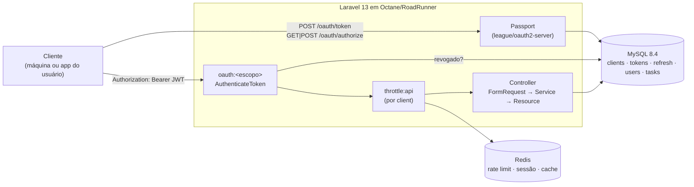
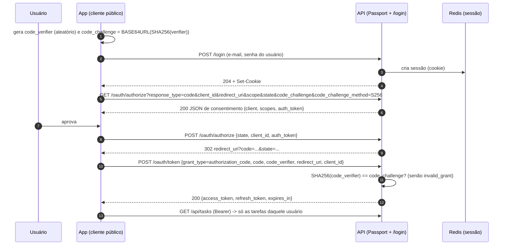
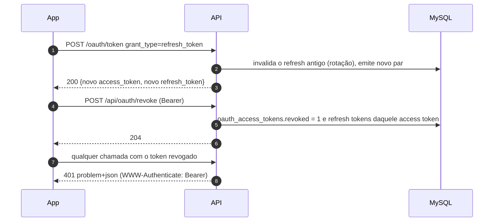

# Arquitetura

Backend **somente API** (sem Blade, sem front) que mostra um servidor OAuth2 real (Laravel Passport) protegendo um recurso
de negócio simples (`tasks`) por **escopos**, rodando em **Octane (RoadRunner)** com MySQL e Redis.

## 1. Visão geral



Camadas (propositalmente finas — KISS):

| Camada | Onde | Responsabilidade |
|---|---|---|
| Protocolo OAuth2 | Passport (`/oauth/*`) | Emitir/renovar/validar tokens; **nenhum código nosso de protocolo** |
| Autenticação/escopo | `app/Http/Middleware/AuthenticateToken.php` | Validar o Bearer, exigir escopos, criar o `Principal` |
| Identidade | `app/Support/Principal.php` | Usuário **ou** cliente-máquina; chave de dono (`user:1`, `client:<uuid>`) |
| HTTP | `Http/Controllers`, `Requests`, `Resources` | Validação (Form Requests) e serialização (API Resources) |
| Regra de negócio | `app/Services/TaskService.php` | Criar/atualizar tarefa + itens em transação |
| Erros | `app/Support/ProblemDetails.php` | Qualquer exceção → `application/problem+json` (RFC 9457) |

## 2. Fluxos OAuth2

### 2.1 Client credentials (máquina → API)

```mermaid
sequenceDiagram
    autonumber
    participant M as Cliente (máquina)
    participant P as /oauth/token (Passport)
    participant A as API (/api/*)
    participant DB as MySQL
    M->>P: POST grant_type=client_credentials, client_id, client_secret, scope
    P->>DB: valida client (secret com hash) e grava o token
    P-->>M: 200 {access_token (JWT RS256), expires_in=3600}
    M->>A: GET /api/tasks  Authorization: Bearer JWT
    A->>A: verifica assinatura + exp; escopo tasks:read?
    A->>DB: token revogado? (1 SELECT por id)
    A-->>M: 200 + ETag (ou 401 / 403 / 429)
```

### 2.2 Authorization code + PKCE (usuário → app → API)



Pontos que o código garante (e os testes provam):

- Cliente **público sem `code_challenge`** é recusado (`invalid_request`); verifier errado → `invalid_grant`.
- O `auth_token` da etapa de aprovação é o anti-CSRF dessa etapa (por isso `oauth/authorize` está fora do CSRF do `web`).
- O código de autorização é de uso único.

### 2.3 Refresh e revogação



Reusar um refresh token já usado ou de um token revogado devolve `invalid_grant`.

### 2.4 Tabela de respostas

| Situação | Status | Corpo |
|---|---|---|
| Sem token / token inválido / expirado / revogado | 401 | `problem+json` + `WWW-Authenticate: Bearer` |
| Token válido sem o escopo da rota | 403 | `problem+json` com `required_scopes` |
| Recurso de outro dono | 404 | indistinguível de inexistente (não vaza existência) |
| Payload inválido | 422 | `problem+json` com `errors` |
| Limite excedido | 429 | `problem+json` + `Retry-After` |
| Erros do protocolo em `/oauth/*` | 400/401 | JSON do RFC 6749 (`error`, `error_description`) — mantido do Passport |

## 3. Decisões de modelagem que valem a pena notar

- **Dono polimórfico leve**: `tasks.owner` = `user:{id}` ou `client:{uuid}`. Evita FK para duas tabelas e deixa
  *client credentials* e *authorization code* usarem o mesmo recurso. Contrapartida: sem integridade referencial no dono.
- **Índices**: `tasks (owner, id)` e `(owner, status, id)` — a ordem de criação importa (ver comentário na migration;
  conferido com `EXPLAIN` com 20 mil linhas). `oauth_access_tokens/refresh_tokens (expires_at)` e `(revoked)` para o
  `passport:purge`. `task_items.task_id` indexado pela FK (usado no eager loading).
- **Sem N+1**: a listagem usa `with('items')`; `Model::preventLazyLoading()` fora de produção e um teste de contagem de queries.
- **Tokens**: acesso 60 min, refresh 14 dias (`config/api.php`), `passport:purge` diário (`routes/console.php`, rodado pelo
  serviço `scheduler`).
- **HTTP cache**: `GET` com `Cache-Control: private, max-age=0, must-revalidate` + `ETag`; `If-None-Match` → 304.
  `private` porque a resposta depende do token.

## 4. Estratégia de testes

Ver [ADR 0005](adr/0005-testing-strategy.md). Resumo: PHPUnit; feature tests para todos os fluxos OAuth2 e o CRUD; unit
tests para `Principal`, `ProblemDetails` e regras; SQLite em memória por padrão e a mesma suíte no MySQL (`make test-mysql`);
PCOV com gate de cobertura; PHPStan nível 8 + Pint.

## 5. Como adicionar um recurso protegido por escopo (passo a passo)

Exemplo: `notes` com `notes:read` / `notes:write`.

1. **Escopo** — em `app/Support/Scopes.php` adicione `NOTES_READ`/`NOTES_WRITE` e as descrições em `ALL`
   (isso já os registra no Passport e na tela de consentimento).
2. **Migration + Model** — tabela com a coluna `owner` (`string(64)`) e índice `(owner, id)` **declarado primeiro**.
   Model com `scopeOwnedBy(Principal)` (copie o de `Task`). Se houver relação, carregue com `with()`.
3. **Form Request** — `StoreNoteRequest`/`UpdateNoteRequest` (a autorização é a do escopo na rota; `authorize()` retorna `true`).
4. **Resource** — `NoteResource` (use `whenLoaded` para relações, para o `preventLazyLoading` pegar esquecimentos).
5. **Controller** — receba `Request`, obtenha `Principal::from($request)`, **sempre** consulte via `ownedBy($principal)`
   e use `findOrFail` (dono diferente = 404).
6. **Rotas** (`routes/api.php`) — dois grupos, na ordem `oauth` depois `throttle`:
   ```php
   Route::middleware(['oauth:'.Scopes::NOTES_READ, 'throttle:api'])->group(function () use ($cache) {
       Route::get('notes', [NoteController::class, 'index'])->middleware($cache);
   });
   Route::middleware(['oauth:'.Scopes::NOTES_WRITE, 'throttle:api'])->group(function () {
       Route::post('notes', [NoteController::class, 'store']);
   });
   ```
7. **Testes** — copie `TaskCrudTest` (CRUD + isolamento por dono), um caso 403 de escopo e um de contagem de queries.
8. **OpenAPI** — `make openapi` (um teste falha se `docs/openapi.json` ficar desatualizado).
9. **Confira** — `make lint && make coverage`.

Checklist rápido: escopo registrado · rota com `oauth:<escopo>` **antes** do `throttle:api` · query sempre por dono ·
`with()` nas relações · Form Request · Resource · teste 401/403/404-de-outro-dono · `make openapi`.
